# xxproject
SpringCloud 微服务综合实例。分布式配置中心，服务发现&负载均衡，链路断路器，API网关，OAuth2认证授权，分布式追踪，ELK日志中心，Docker持续交付等最佳实践。

## Features:    
- [x] 分布式配置中心, 通过消息总线更新配置
- [x] Eureka实现服务端服务注册/服务发现/负载均衡
- [x] Feign实现客户端负载均衡
- [x] Hystrix实现链路断路器
- [x] Zuul实现API网关
- [x] Zipkin&Sleuth实现分布式追踪
- [ ] 消息驱动
- [ ] 分布式锁&信号量
- [ ] 统一异常处理
- [ ] 统一HTTP处理
- [ ] 国际化
- [x] OAuth2.0与安全
- [ ] API文档与测试
- [ ] 批处理
- [ ] 分布式任务调度
- [ ] 分布式ID中心
- [x] 日志收集
- [ ] 同步与异步调用
- [ ] RPC调用
- [ ] 其他最佳实践

## Overview:    
- 系统全景图:    
  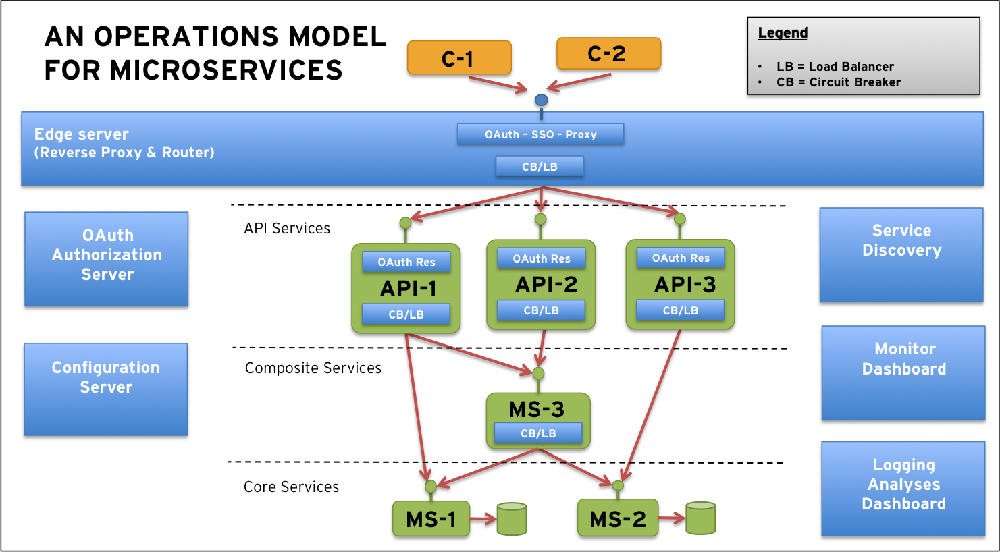    
  
- 技术实现:    

  | 服务 | 实现方案 | 项目 |   
  | ------------------- | ------------------- | ------------------- |      
  分布式配置中心 | SpringCloud Config Server | support/config-server     
  服务注册/负载均衡 | Netflix Eureka | support/eureka-server     
  客户端负载均衡 | NetFlix Ribbon | --      
  链路保护与监控 | NetFlix Hystrix | support/turbine-server & support/hystrix-dashboard           
  API网关 | NetFlix Zuul | support/zuul-server               
  分布式追踪调用链分析 | SpringCloud Sleuth | support/zipkin-server           
  OAuth2认证授权 | SpringCloud Security OAuth | support/auth-server       
  基础服务 | -- | core/product-service & core/review-service         
  聚合服务 | -- | composite/product-composite-service          
  API服务 | -- | api/product-api-service                
  日志处理 | ELK | --                        
  容器化部署 | Docker Compose | --          
      
## Compile:
- 编译构建为Jar包: `mvn clean package`    
- 编译构建为Docker镜像: `mvn clean package docker:build`,  镜像列表:    

  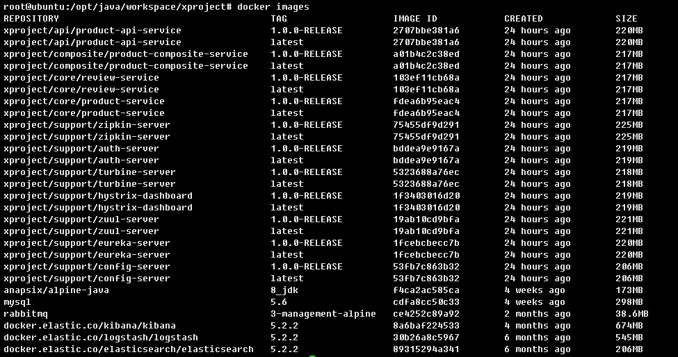
  
## Deploy:
- Jar方式部署: `可参考READM步骤`    
- Docker方式部署: `source bootstrap.rc && docker-compose up -d`, 检查以下17个容器正常运行:        

  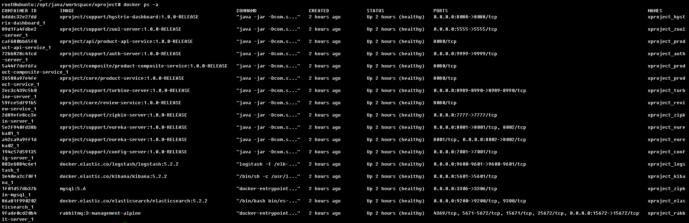 
- 部署完成, 访问Eureka, 查看注册的服务实例如下:  
  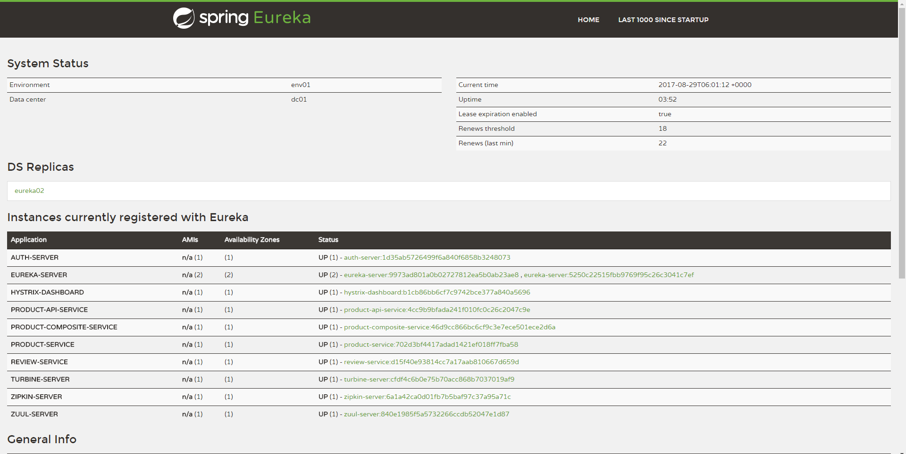 
  
## Enjoy:
- 访问OAuth Server:     
  http://localhost:9999/uaa/oauth/authorize?response_type=code&client_id=acme&redirect_uri=http://example.com&scope=webshop&state=97536,     
  输入用户名密码 `(admin/passw0rd)`     
- 同意OAuth授权, 如下:    
  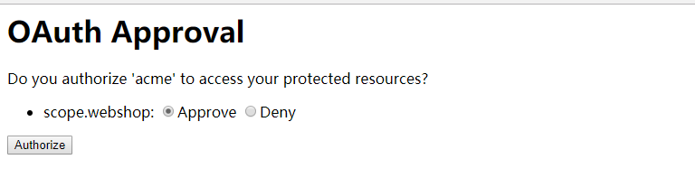 
- 页面跳转到: http://example.com/?code=5J4vJ8&state=97536,     
  该页面可以获取CODE, 如下:    
  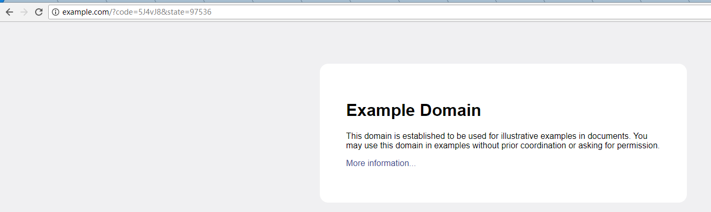 
- 通过CODE获取TOKEN: 
  ```
  CODE=5J4vJ8
  curl acme:acmesecret@localhost:9999/uaa/oauth/token \
	-d grant_type=authorization_code \
	-d client_id=acme \
	-d redirect_uri=http://example.com \
	-d code=$CODE -s | jq .
  TOKEN=bd34faf8-dcd0-4aed-a903-c8a90cb7a731
  ```
- 以上获取TOKEN步骤截图如下:
  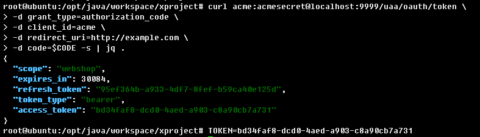   
- 访问API服务: http://localhost:5555/api/product-api-service/product-api-composite,     
  返回成功, 并且消息头携带X-RequestId, 如下:   
  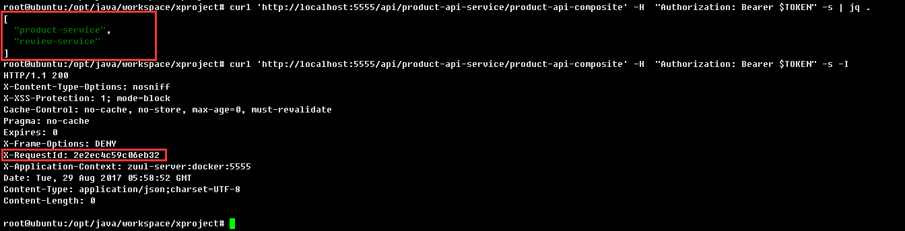 
- 访问追踪系统: http://localhost:7777/zipkin/,     
  - 调用链分析如下:   
    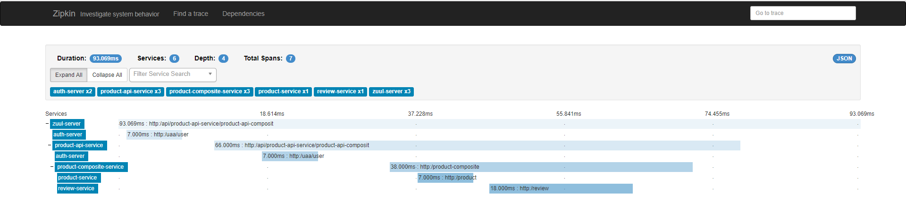 
  - 服务依赖拓扑图如下:   
    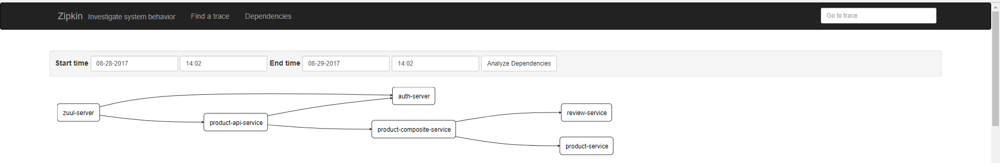 
- 访问链路保护系统:     
  http://localhost:8088/hystrix/monitor?stream=http%3A%2F%2Fturbine-server%3A8989%2Fturbine.stream,     
  链路断路器状态如下, 可以看到断路器状态, 调用次数, 失败次数、线程池等信息: 
  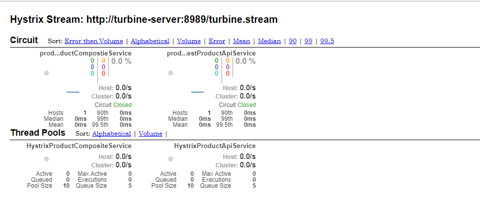 
- 访问ELK日志系统: http://localhost:5601, 如下: 
  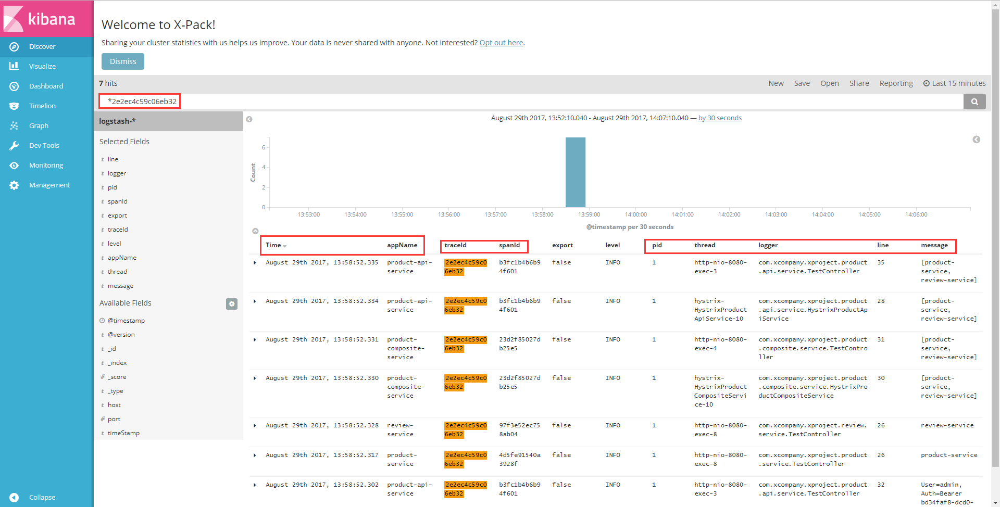 
- 使用jvisualvm监控JVM实时性能指标,         
  - CPU、内存占用分析如下:    
             
  - 线程视角性能分析如下:      
    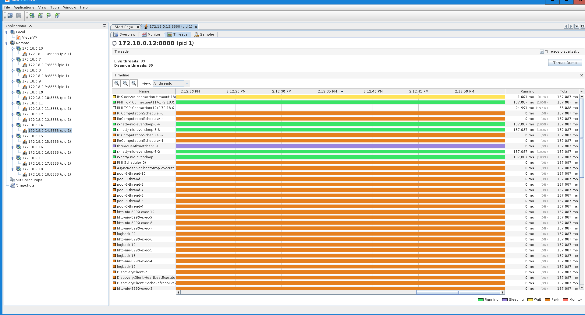     
  
